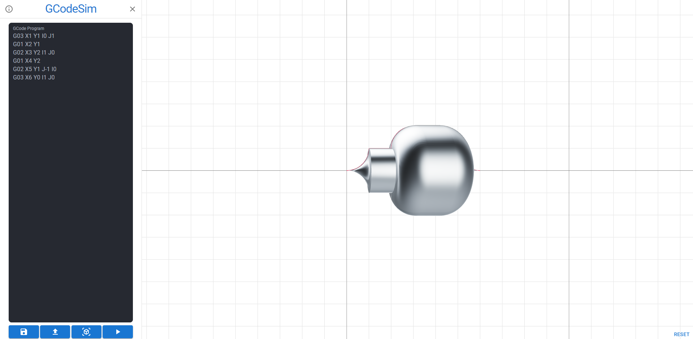

# GCode Simulator

Simple project that draws two-dimensional lines on a flat XY plane from a given program written in GCODE.
It simulates how the tool of a CNC machine moves with a given program.

(Click the image below to redirect to the hosted app)

## TODO

- ✅ Prepare 3D canvas
- ✅ Implement camera controls
- ✅ Prepare drawer with text area for gcode
- ✅ Interprete gcode to data about lines (type, coords of ending, centre of arc etc.)
- 🚧 Create better validation of gcode
- ✅ Draw lines on 2D plane
- ✅ Draw different line types
- ✅ Draw lines with animation
- ✅ Create a drawer to save/load the program (for now it can be local storage)
- ✅ Create a snack bar with appropriate notifications (e.g. on program save, errors etc.)
- ✅ Error handling
- ✅ Extrude model with given lines (by rotation around X axis)
- ✅ Find a way to extrude the concave model
- ✅ Create modals with info about the program, saving/loading models etc.
- 🚧 Add unit tests
- ❔ Create an option to import/export the model (e.g. .step file)
- ❔ Create simple documentation
